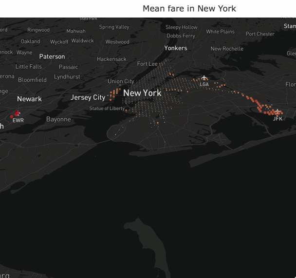
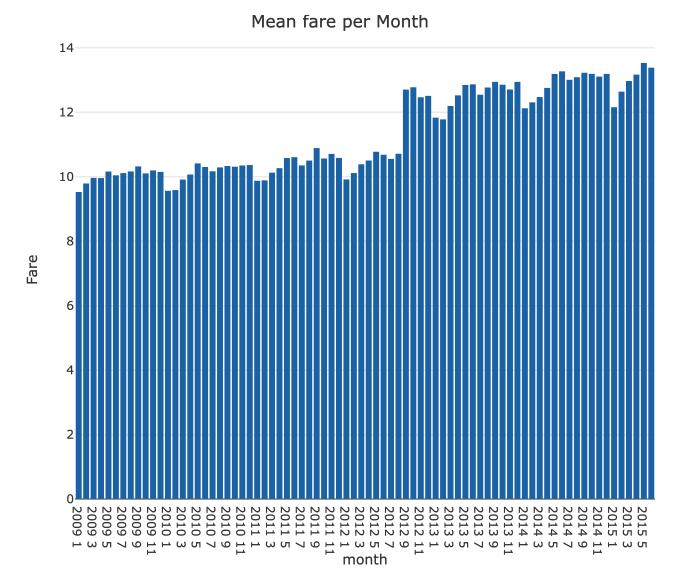
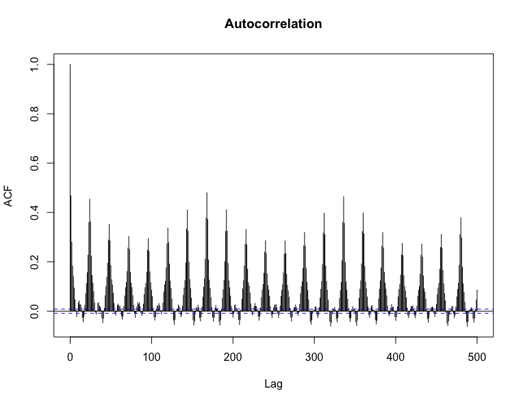
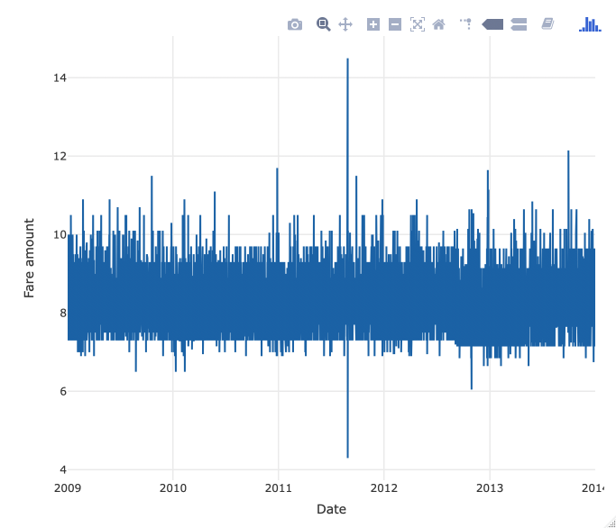
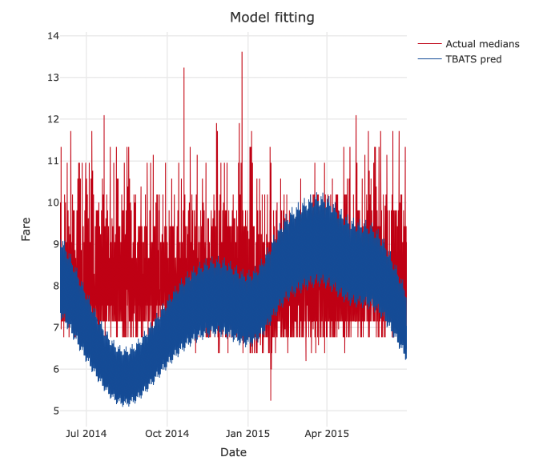
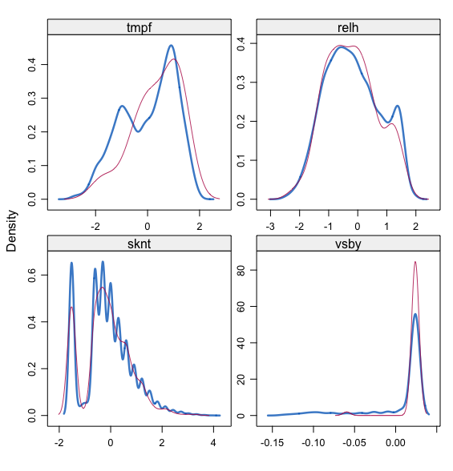
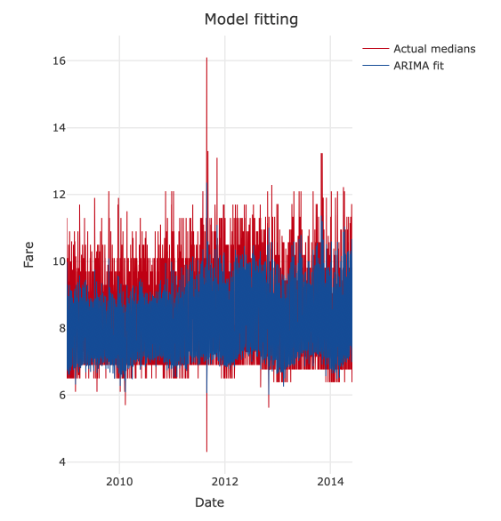
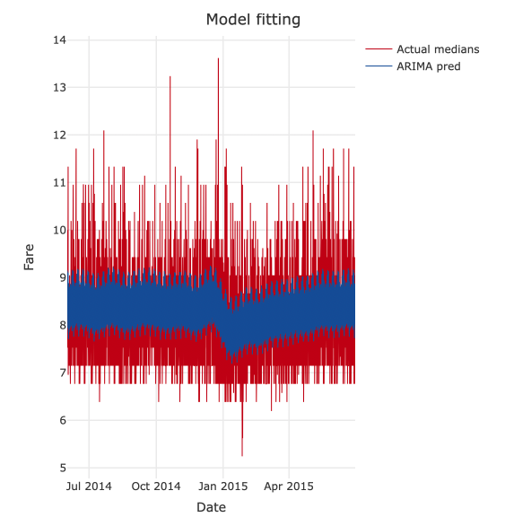
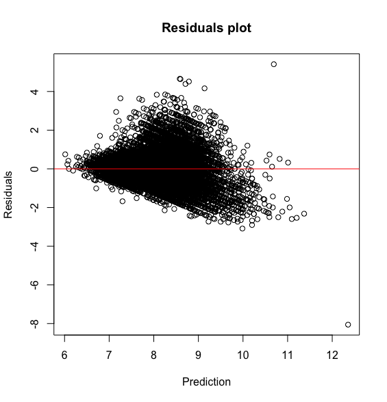

```{r setup, include=FALSE}
knitr::opts_chunk$set(echo = TRUE)
```

# Project presentation

Nowadays, it is claimed that more than half of the world population lives in urban areas. Added to the increasing amount of available urban data, this allows data-driven analyses to greatly improve the lives of citizens. As a consequence, we decided to focus more particularly on Taxi trips. Indeed, these are valuable sensors that can tell us about economic activity and human behavior in citys.

We found a data set in a [kaggle competition](https://www.kaggle.com/c/new-york-city-taxi-fare-prediction) supported by *Google*. The goal of this competition is to predict the fare amount (inclusive of tolls) for a taxi ride in New York City. The dataset initially contains taxi trips from 2009 to mid-2015. For each row in the set, corresponding to a trip, there is the pickup and drop-off geolocalisations, the number of passengers, and the date and time of the trip as covariates. We considered this data valuable as they appeared to be rather exhaustive, covering more than 54M of trips. Moreover, there were no missing data, although some seemed erroneous as we will see later. 

One the competition homepage, it was stated that basic predictors achieve RMSEs of about $5-8\$$. Our objective was then to improve such scores. However, the dataset was too heavy for us to analyze. Therefore, as you will see, we have decided to first aggregate these data and perform some prediction on these. After that, we have sampled $50000$ from the original dataset. These were then split between train (trips before June 2014) and test sets (trips after June 2014).

# Exploratory data analysis and feature engineering


## Geographical insights


First, we have looked on the locastion of the taxi trips. Looking at extremal values, we have seen that some trips were located outside of New York, sometimes even on the other side of the world. In addition, we have only kept trips with less than 10 passengers, as more doesn't seem much plausible. These rows were then discarded.

Below, we have plotted the locations that are the most likely to be associated to a trip. The bigger the dot is the more the color tend to a red shade, the more trips have their pickup (or drop-off) location located there.

```{r  out.width = "50%", echo=FALSE}
knitr::include_graphics(c('./Plots/PickupLoc.png', './Plots/DropoffLoc.png')) 
```

As we can see, most of the trips start in the center of Manhattan or the airports. As for the drop-offs, the repartion is still concentrated on Manhattan, although a bit more spread. All in all, airports and Manhattan accounts for most of the trips origin/destination. If we look at a similar plots for the fare amounts below, the prominent role of airports is more obvious. Indeed, trips coming from airports seem more expensive. We then add new features to the data to indicate whether the trips came from or were going to the airports (Newark, LaGuardia and JFK).

```{r  out.width = "50%", echo=FALSE, fig.align='center'}
 
```

## Temporal insights

We have tried to discover some trend in the data with regards to temporal characteristics of trips. We've found that the data were evenly distributed with regards to most of the features we have extracted (day of the week, year...). The fare amount were as well not really influenced y most of these features.

Still, we have managed to find some interesting facts in the data. First, the histogram of the mean fare observed per month below shows that there is a significant price increase inseptember 2012. We have found that [a new law](https://www.nbcnewyork.com/local/Taxi-Fare-Hike-September-4-Drivers-Scheduled-Inspections-Mixed-Fares-168395016.html) in New York resulted in this price increase. Consequently, to better forecast the prices, we have rescaled the post-legislation data and modified their fare mean. 

```{r  out.width = "50%", echo=FALSE, fig.align='center'}
 
```

Yhen, among the different the time features that we've extracted, the hour is the only one that seemed to impact the price. Indeed, we can see a peak in the trip price for trips around 5a.m. Moreover, only a few trips are observed at this time of the day. Therefore, it is still valuable to add feature such as the hour of the trip as covariates for our models.

```{r  out.width = "50%", echo=FALSE}
knitr::include_graphics(c('./Plots/MeanFarePerHour.png', './Plots/TripsPerHour.png')) 
```


# Model on aggregated data: Temporal component estimation

In an attempt to highlight a trend on the whole city, we have aggregated the data to obtain the mean fare observed over the city per hour. As explained at the beginning of this report, these new data were then split between train and test sets according relative position of the data to june 2014.
From the autocorrelation plot below, we can clearly see that there are two different seasonnality (daily and weekly). With a bigger scale on the plot, we have also discovered a yearly seasonnality. Following the paper from [R.J. Hyndman et al. (2012)](https://robjhyndman.com/papers/ComplexSeasonality.pdf), we have fit a tbats model as this method is built to forecast complex seasonal time series. This preliminary step allows us to analyze the temporal component of our data. Indeed, the aggregation allows us to obtain data with even time steps which is a prerequisite for most time series analysis tools. 

```{r  out.width = "50%", echo=FALSE, fig.align='center'}
 
```

The new time series is then presented on the plot below (with the effect of the new legislation taken into account and offset). We have tried to understand what could have caused the extreme values observed in mid-2011. It occured that these happened when the [hurricane Irene](https://www.theguardian.com/world/blog/2011/aug/28/hurricane-irene-new-york-live-coverage1) struck New York. This has led us to include weather data as covariated as you will see later.

```{r  out.width = "50%", echo=FALSE, fig.align='center'}
 
```


## TBATS

As shown above, one can see that there numerous seasonnality in the aggregated series. We have decided to first fit a TBATS model on these data.
First, the model BATS is described by the following equations, including a Box-Cox transformation on the observed series $y_t$:

$$y_t^{(\omega)} =
  \left\{
    \begin{split}
    \frac{y_t^\omega-1}{\omega},\ \omega\neq 0\\ 
    \log(y_t),\ \omega=0
    \end{split}
  \right.$$
  
$$y_t^{(\omega)} = l_{t-1} + \phi b_{t-1} + \sum_{i=1}^T s_{t-m_i}^{(i)} + d_t$$
$$l_t = l_{t-1} + \phi b_{t-1} + \sum_{i=1}^T s_{t-m_i}^{(i)} + \alpha d_t$$
$$b_t = (1-\phi)b + \phi b_{t-1} + \beta d_t$$
$$s_t^{(i)} = s_{(t-m_i)}^{(i)} + \gamma_i d_t$$
$$d_t = \sum_{i=1}^p \varphi_i d_{t-i} + \sum_{i=1}^q \theta_i \epsilon_{t-i} + \epsilon_t$$
Here, $m_i$ denotes the seasonal period of the $i^{th}$ seasonal component $s_t^{(i)}$, $l_t$ is the local level, $b$ is the long-term trend, $b_t$ isd the short-term trend, $d_t$ is an \textit{ARMA(p,q)} process and $\epsilon_t$ is Gaussian white noise. Besides, $\alpha$, $\beta$ and $\gamma_i$ are smoothing parameters and $\phi$ is a damping parameter. The model is then associated to the identifier BATS($\omega,\phi,p,q,m_1,m_2,...,m_T$). One can note that this model generalizes the Holt–Winters additive seasonal model as it is given by the BATS$(1, 1, 0, 0, m1 )$. One interesting feature there is that it allows to take into account autocorrelation in the residuals.

In the TBATS model, one uses a trigonometric representation of seasonal components based on Fourier series with smoothing parameters $\gamma_1^{(i)}$ and $\gamma_2^{(i)}$ and $\lambda_j^{(i)}=\frac{2\pi j}{m_i}$, which results in:

$$s_t^{(i)} = \sum_{j=1}^{k_i} s_{j,t}^{(i)}$$
$$s_{j,t}^{(i)} = s_{j,t-1}^{(i)}\cos(\lambda_j^{(i)}) + s_{j,t-1}^{*(i)}\sin(\lambda_j^{(i)}) + \gamma_1^{(i)}d_t$$
$$s_{j,t}^{*(i)} = -s_{j,t-1}^{(i)}\sin(\lambda_j^{(i)}) + s_{j,t-1}^{*(i)}\cos(\lambda_j^{(i)}) + \gamma_2^{(i)}d_t$$

$$y_t^{(\omega)} = l_{t-1} + \phi b_{t-1} + \sum_{i=1}^T s_{t-1}^{(i)} + d_t$$

Such representation with finite numbers of harmonics $k_i$ allows a much simpler estimation procedure. The model is then designated by the identifier TBATS$(\omega,\phi,p,q,{m_1, k_1}, {m_2, k_2},...,{m_T,k_T}).$. Applied on our time series, with daily, weekly and yearly seasonnalities, one obtain the model TBATS$(0,0.8,0,0,{24, 5}, {168, 4},{8766,7})$. On the train data, we have got a RMSE of $0.4607317$ on the train and a $R^2$ coefficient of $0.5318792$. On the following plots, we expound the results obtained


```{r  out.width = "50%", echo=FALSE}
knitr::include_graphics(c('./Plots/TATS_fit.png', './Plots/Residuals_fit.png')) 
```

There, one can see that the model struggled to fit extreme values. In addition, there seems to be some heteroscedasticity in the residuals. Classicaly, this means that there miss some useful covariates in our model. As we have explained before, extreme values may be explained by weather conditions. However, those were the least of the issues with this model as the predicted values of the model on the test set were completely absurd (RMSE of $1.314827$ on the test set). 

```{r  out.width = "50%", echo=FALSE, fig.align='center'}
 
```

## ARIMA with regressors

One needed to find another model. Therefore, one adds weather data with the `Riem` package as we have already explained their interest. One extracted the following features that we have considered useful:

* tmpf: Air Temperature in Fahrenheit
* relh: Relative Humidity
* sknt: Wind Speed in knots
* vsby: Visibility in miles

However, there were some missing variables on the train.

Variable  | Percentage of missing observations
------------- | -------------
relh    | 0.04923700
sknt       | 0.04820420
vsby    | 0.01802125
tmpf       | 0.01207740

Traditionally, the threshold to decide whether to drop a feature or not with regards to the percentage of missing is $5\%$. Therefore, we decided to keep all of these features and perform some imputation. To do so, we used the random forest method and the `mice` package. The algorithm to imput missing values is as follows for one variable to be imputed:

* First, replace missing values by the average values.
* For i = 1,...,M
    + With the imputed values so far, train a Random Forest.
    + Compute the proximity matrix from the random forest.
    + Using the proximity as the weight, impute missing values as the weighted average of non-missing values.
    
The density of the imputed data for each imputed dataset is showed below in magenta while the density of the observed data is showed in blue.
As these are pretty similar, it confirms the hypothesis that the data are MCAR which legitimate our imputation of the missing values. 

```{r  out.width = "50%", echo=FALSE, fig.align='center'}
 
```
  
Following the advice of [R.J. Hyndman](https://robjhyndman.com/hyndsight/tbats-with-regressors/), we fitted an ARIMA process to our data, including our regressors and Fourier terms to take into into account the seasonnality of our data. The principle is to fit a regression of the fare on our different regressors and then fit an ARIMA model on the residuals. This gives us the following results on the train set:

```{r  out.width = "50%", echo=FALSE, fig.align='center'}
 
```

We got a RMSE of $0.5119916$ and a $R^2$ of $0.4219209$, which is slightly worse than our previous model. Still, the model still struggles to fit extreme values, which is even more striking on the test set on which we get a RMSE of $0.76609$:

```{r  out.width = "50%", echo=FALSE, fig.align='center'}
 
```

The plot of the residuals shows a strong heteroscedasticity.

```{r  out.width = "50%", echo=FALSE, fig.align='center'}
 
```

# Residuals prediction

Now, let's go back to our initial goal. The previous model provides us with a prediction per hour. Let's refine this model to predict the fare of individual trips in New York. To accomplish this, we will try to predict the error made by our first rough model which associates to each trip the hourly prediction of the mean fare over New York. The following models will be calibrated using a moving window cross-validation. 
