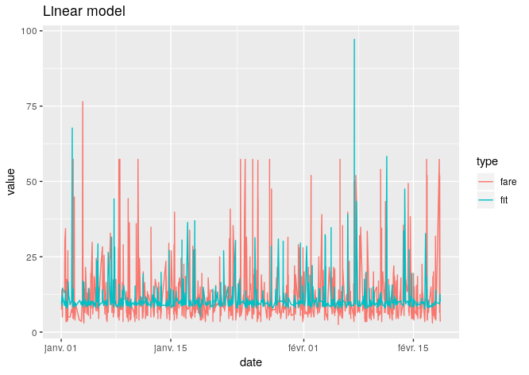
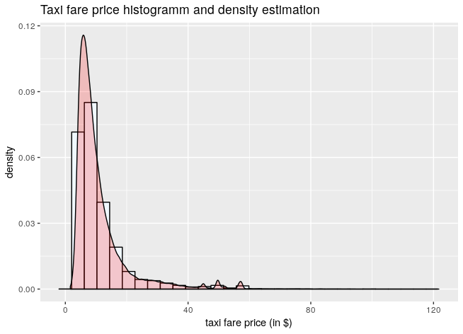
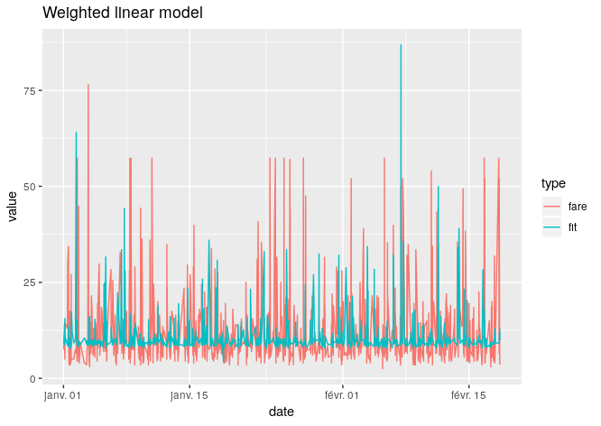
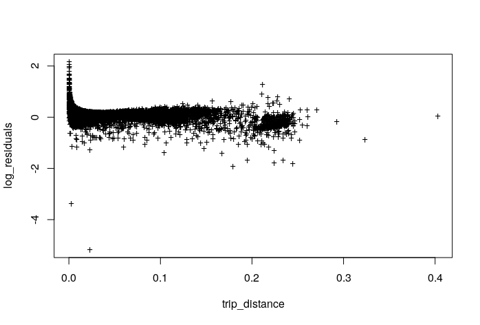
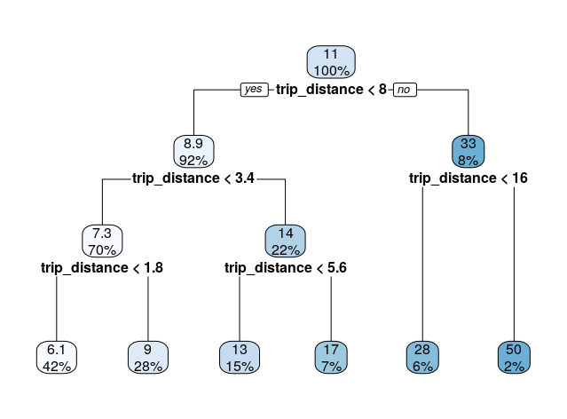
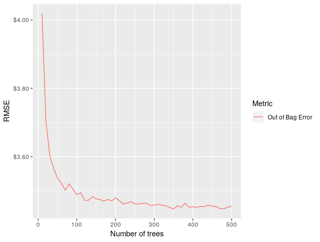
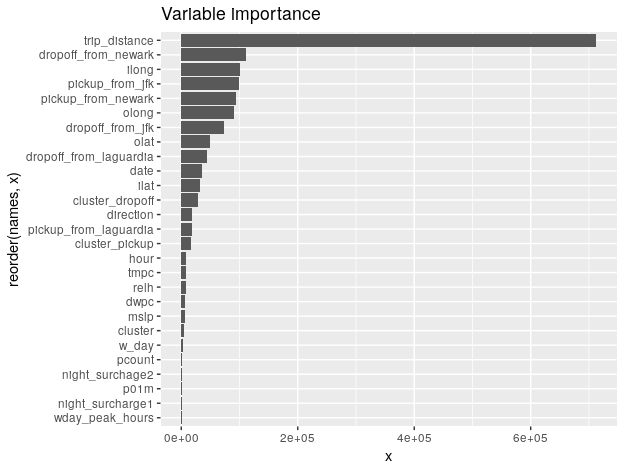
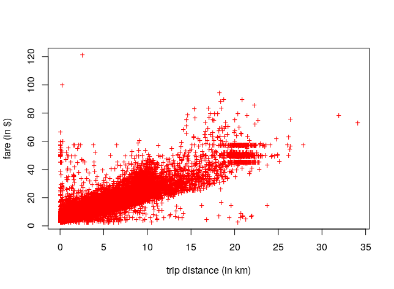
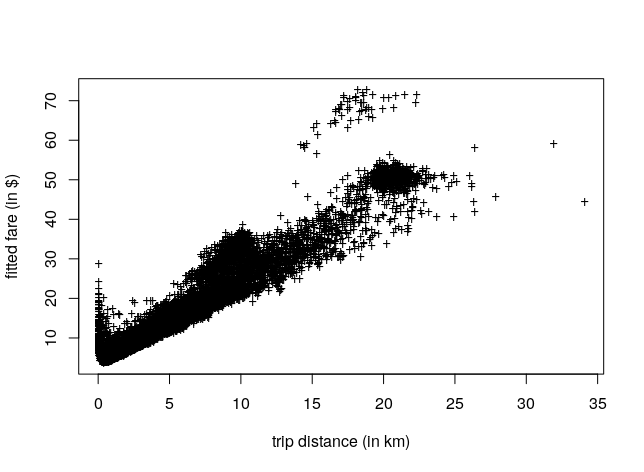

```{r setup, include=FALSE}
knitr::opts_chunk$set(echo = TRUE)
```
## Main goal 

We extract a 50k rows subsample of the 55 millions rows that the full training Kaggle dataset contains due to our lack of computational power. 

To evaluate the performance of each of our model, we will implement a "time-series" cross validation strategy illustrated below.  
.

The metric obsversed will be the mean RMSE (Root Mean Squared Error) between the true and the fitted prices for each of the train/test pairs

Finally, each model will predict the price for the taxi trips after the 1st of June 2014 (basically 8k rows) and will be evaluated by its test error, which is the RMSE of the predicted fare in the test dataset. 


## Feature engineering

Based on the dataset features, others has been engineered.  
`trip_distance` the distance (in km) between the pickup and the dropoff location.  
Distance from JFK, LaGuardia, Newark: the distance to the airports are meaningful for explaining the price.  
`log_trip_distance` logarithm of the trip distance.  
`direction` a angle value in degrees between -180 and 180.

To capture the temporal influence on the taxi fare price we add several engineered features of the timestamp of the taxi ride. 

`w_day` and `hour` respectivly a number between 1 and 7 coding the day of the week, and a number between 0 and 23 for the hour.  
The features `night_surcharge` and `wday_peak_hours` are binary and are build to code the peak hours and night hours price surcharge. (ajouter lien vers la tarification)

## Linear model

To begin with, let's predict our taxi fare price in a linear way. First, we fit a linear model of the logarithm of the price on the given features plus the weather and pollutions features.

Because the price is always a positive value. we will train our model to predict `log(price)`.

```{r modele lineaire simple, warning=FALSE, echo=FALSE, message=FALSE}
library(tidyverse)
library(lubridate)
library(DBI)

data0 <- read_tsv("../Data/data0.csv")


bounding_box <- c(-74.5, -72.8, 40.5, 41.8)

#Airpots in NYC area
jfk <- c(-73.7822222222, 40.6441666667)
laguardia <- c(-73.8719444444, 40.7747222222)
newark <- c(-74.175, 40.6897222222)  

#Difference between the distance to an airport at pickup and dropoff
distance_to_airport <- function(x1, y1, x2, y2, airport) {
  return(abs((x1 - airport[1])^2 + (y1 - airport[2])^2 - (x2 - airport[1])^2 - (y2 - airport[2])^2))
}


library(pracma)
distance_from_coord <- function(row) {
  return(haversine(c(row[1], row[2]), c(row[3], row[4])))
}

distance_from_jfk <- function(row) {
  return(haversine(c(row[1], row[2]), jfk))
}

distance_from_newark <- function(row) {
  return(haversine(c(row[1], row[2]), newark))
}

distance_from_laguardia <- function(row) {
  return(haversine(c(row[1], row[2]), laguardia))
}

calculate_direction <- function(d_lon, d_lat) {
  l <- (d_lon^2 + d_lat^2) %>% sqrt()
  result <- 1000
  if (d_lon >= 0) {
    result <- 180/pi * asin(d_lat/l)
  }
  else if (d_lon < 0 & d_lat >= 0) {
    result <- 180 -  180/pi * asin(d_lat/l)
  }
  else if (d_lon < 0 & d_lat < 0) {
    result <- -180 -  180/pi * asin(d_lat/l)
  }
  return(result)
}


data1 <- data0 %>% 
  arrange(date) %>%
  filter(fare > 0) %>%
  filter(ilong > bounding_box[1], ilong < bounding_box[2]) %>%
  filter(olong > bounding_box[1], olong < bounding_box[2]) %>%
  filter(ilat > bounding_box[3], ilat < bounding_box[4]) %>%
  filter(olat > bounding_box[3], olat < bounding_box[4]) %>%
  filter(pcount < 10) %>%
  mutate(log_fare = log(fare)) %>% 
  mutate(w_day = wday(date), hour = hour(date)) %>%
  mutate(night_surcharge1 = (hour >= 20)) %>%
  mutate(night_surchage2 = (hour <= 6)) %>%
  mutate(wday_peak_hours = (w_day > 1) & (w_day < 6) & (hour >= 16) & (hour <= 20)) %>%
  drop_na() %>%
  as_tibble()

delta_lon <- data1$ilong - data1$olong
delta_lat <- data1$ilat - data1$olat

data1$direction <- unlist(map2(delta_lon, delta_lat, calculate_direction))


#Correction of the price legislation 
d <- as.POSIXct("2014-09-04 00:00:00", format = "%Y-%m-%d %H:%M:%S")
data1[which(data1$date > d), ] <- data1[which(data1$date > d), ] %>% mutate(fare = fare - .872560979169837)


data1$trip_distance <- apply(data1[, c('ilat', 'ilong', 'olat', 'olong')], 1,
                        distance_from_coord)

data1$pickup_from_jfk <- apply(data1[,c('ilong', 'ilat')], 1, distance_from_jfk)

data1$pickup_from_laguardia <- apply(data1[,c('ilong', 'ilat')], 1, distance_from_laguardia)

data1$pickup_from_newark <- apply(data1[,c('ilong', 'ilat')], 1, distance_from_newark)

limit <- as.POSIXct("2014-01-01 00:00:00", format = "%Y-%m-%d %H:%M:%S")
train <- data1 %>% filter(date < limit)
test <- data1 %>% filter(date >= limit)

lm0 <- lm(log_fare ~ . - fare, train)
fit <- predict(lm0, test) 

summary(lm0)
plot(lm0, which = 1, pch = "+")
```

As we see, the spatial features are very relevant by looking at the p-values, the weather data are of less importance. There're still informations left in the residuals as shown in the plot above.

The mean RMSE obtained is 6.69`$`, the test error is 6.6`$`. The following plot represents the predicted and true fare for the 1000 first observations in the test set.




We notice that the linear model tends to underestimate the fare price. Probably due to the high number of outliers. By looking at a density estimation of the fare price we 
notice a heavy tail and a highly positive skewness:



With such a taxi fare price distribution, fitting a linear model will be difficult. 

Let's try to cope this issue by affecting a zero weight to the observations with a fare price superior to 50`$`
With this second linear model, we obtain a mean RMSE of 4.79`$`. But it degrades the test error to 6.4`$` 



This model seems to be a bit less conservative than the previous one.

A main issue that we will tackle in the following models is the heteroskedasticity of the fare price in respect to the trip distance as well as a bias as we see in this plot:



Our model seem to underestimate the fare price for a small trip distance. Thus this variable seems to be useless to predict prices in this range of valus. In fact, it's reasonable to think that when the distance of the taxi ride is close to zero. The price might depend more on other variables (traffic, weather, etc...) than on the distance.  

The linear model are clearly not efficent, the exponential transformation leads to propagation of errors.

Now let's dig a new family of models, which will be more robust and allow us to detect the non linearities.

## CART and Random Forest

Random Forest method is based on bagging of decision tree. Let's look at one decision tree first.



With this basic plot one can see that the `trip_distance` variable seems to have a lot of influence.
With a "Time-series" cross validation method. A mean RMSE of 3.33`$` and a test error of 4.67`$` is found. That's a lot better that our linear models. We have now the feeling that performing a random forest on our dataset will be performing well. Let's look how much the mean RMSE could be improved.

A random forest has a lot of hyperparameters to tune. First let's determine the number of trees by a performing a grid search on the train dataset.



`num.trees = 300` seems to be efficient enough in terms of OOB (Out Of Bag) error. 

Let's do a grid search to find which hyperparameters seem optimal in terms of OOB (Out Of Bag) error.

```{r}
grid_search <- expand.grid(
  mtry       = seq(1, 9, by = 1),
  node_size  = seq(3, 9, by = 2), 
  sample_size = 0.5
)
```

The final random forest is the following 

```{r eval=FALSE}
rf <- ranger(formula = fare ~ . ,
                     data = train,
                     num.trees = 300,
                     mtry = 8,
                     min.node.size = 9,
                     sample.fraction = 0.5)
```


With a "time series" cross validation method we obtain a mean RMSE of 2.93`$` and a test error of 3.316`$` for the optimal Random Forest found thanks to the previous method. Which is a bit better than with a basic CART.

Now recall from the beginning of the report, an interesting idea could be to do a unsupervised machine learning method like clustering to add some useful features to feed our random forest and improve the mean RMSE.


We perform then 3 K-Means (with K = 5) on the dropoff, pickup, and both coordinates. We obtain after that a mean RMSE of 2.64`$` and a test error of 3.314`$`. The K-means seems to capture valuable information about the spatial distribution of the taxi rides, which help our random forest to learn.


As we see on this plot, our cluster random forest fit a lot better than a linear model.
At this point, we need to know where are the difficulties we need to tackle for a better prediction. To observe variable importance we compute how much a variable reduce the `node impurity`. 


As observed on the plot above, The variable `trip_distance` seems to be very impactful compared to the others to predict the fare price, It is then of good reason to plot the relation between fare price and trip distance.



This plot is to be compared with our random forest prediction.




By looking at this plot one may notice that the random forest predicts pretty well the price that are very dependent in respect of the distance but not the prices which are independent of it. An interpreation could be that prices in this region are dependent of latent variables that are not in our dataset.

To confirm this hypothesis, a new linear model is fitted only on the `trip_distance` variable.


```{r, warning=FALSE, echo=FALSE, message=FALSE}
lm2 <- lm(log_fare ~ trip_distance, train)
summary(lm2)
plot(lm2, which = 1, pch = "+")

fit <- predict(lm2, test)
```

The information left in the residuals seems to be of less importance compared to the previous linear model trained on all the features. But the test error is very high (8.65`$`).


## Conclusion

Our work was meant to be exploratory, by observing the performance of several model, and see where the predictions can be improved and the limits of our dataset. In termes of performance error our work can be compared with the best kaggle kernels, the best test error on Kaggle lies around 3`$`. In terms of interpretability, looking at the variable importance for random forest give a very good insight why nobody seems to get lower to 3`$` as a test error, the `trip_distance` variable is so influent that it might hinder some other dependencies of the fare price to others dataset's features. An other interpretation could be that some observations could be independent of the dataset variables and thus very hard to predict. A solution could be to enriched our dataset with other features (like traffic in NY for instance).


